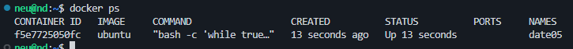

# Dátumok

A feladatok megoldása után készítsen képernyőképet, ahol **mind a kiadott parancs, valamint a pontos dátum és idő is látható**! A képernyőképeket mentse a forrásban kapott Word fájlba! A Word fájlt nevezze el az alábbiak szerint: *vezeteknev_keresztnev_datumok.docx*

1. Futtasson egy konténert az Ubuntu legfrissebb verziójából date01 néven, az Ubuntu kapja meg paraméterül a date parancsot! Ellenőrizze a konténer állapotát!

2. Futtasson egy konténert az Ubuntu legfrissebb verziójából date02 néven, interaktív módban!

a. Adja ki manuálisan a date parancsot!

b. Egy új terminál megnyitásával vizsgálja meg a futó konténerek kiírásával a konténer állapotát!

3. Futtasson egy konténert az Ubuntu legfrissebb verziójából date03 néven, a konténer root mappájába csatolja fel a forrásban kapott feladat03.sh bash scriptet! Ne felejtse az abszolút hivatkozást! Az Ubuntu kapja meg paraméterül, hogy a bash paranccsal fusson le a felmásolt script fájl!

4. Futtasson egy konténert az Ubuntu legfrissebb verziójából date04 néven, a konténer root mappájába csatolja fel a forrásban kapott feladat04.sh bash scriptet, illetve a konténerben a TZ környezeti változó értékét állítsa be `America/New_York` értékűre! Ne felejtse az abszolút hivatkozást! Az Ubuntu kapja meg paraméterül, hogy a `bash` paranccsal fusson le a felmásolt script fájl!

5. Futtasson egy konténert az Ubuntu legfrissebb verziójából date05 néven, dettached módban! A konténer ne tör-lődjön leállítás esetén! Az Ubuntu kapja meg paraméterül az alábbi parancsot: `bash ‑c "while true; do date; sleep 5; done"`

a. Vizsgálja meg a futó konténereket!

b. Vizsgálja meg a date05 konténer eredményét a logokban! Oldja meg, hogy a logok folyamatosan firssüljenek!

c. Állítsa le a konténert!

d. Indítsa el újra ugyanazt a konténert!

e. Próbálja meg kitörölni a konténert. Orvosolja az esetlegesen felmerülő hibákat!

6. Törölje az össze konténert, amely nevében szerepel a date szó! Használjon egy parancsot!

**Nincsen hiba, nem kell force stop, ha előtte manuálisan leállítom a containert.**

> [!TIP]
> A törléshez használt parancsnak adja át a listázáshoz használt parancs eredményét. A listázásnál szűrjön a date nevű konténerekre. Csak a hasheket a ‑q kapcsoló segítségével kaphatja vissza. 1 / 1 Készítette: Kurityák Dániel

### Feladatleírást készítette: Kurityák Dániel
