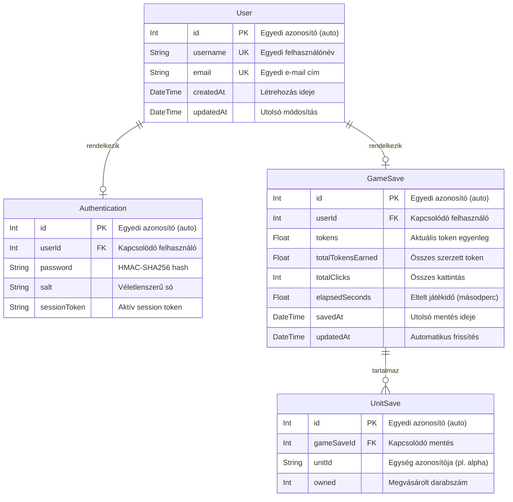

# UML diagram – Adatbázis séma



## Táblák leírása

### `User`
A regisztrált felhasználók alapadatait tárolja. A `username` és az `email` mező egyedi kényszert kapott, hogy ne lehessen kétszer regisztrálni ugyanazt az e-mail címet vagy felhasználónevet.

### `Authentication`
A `User` táblával 1:1 kapcsolatban álló tábla, amely a hitelesítéshez szükséges érzékeny adatokat tartalmazza. A `password` mező nem nyers jelszót, hanem HMAC-SHA256 hash-t tárol, amelyhez a `salt` adja a sót. A `sessionToken` tartalmazza a bejelentkezéskor kiadott tokent; kijelentkezéskor ez üres stringre módosul (invalidálás).

### `GameSave`
Felhasználónként legfeljebb egy mentés létezhet (1:1 kapcsolat a `User` táblával). Az összesített játékstatisztikákat (egyenleg, összes szerzett token, kattintások száma, eltelt idő) tárolja. A `savedAt` mező minden `PUT /save` hívásnál frissül.

### `UnitSave`
Az egyes egységtípusokhoz tartozó megvásárolt darabszámokat tárolja. Egy `GameSave`-hez több `UnitSave` sor is tartozhat (1:N kapcsolat). A `gameSaveId + unitId` páros egyedi kényszert kapott, hogy egy mentésen belül minden egységtípus legfeljebb egyszer szerepeljen. Ha a szülő `GameSave` törlésre kerül, az összes kapcsolódó `UnitSave` sor automatikusan törlődik (`ON DELETE CASCADE`).

## Kapcsolatok összefoglalója

| Forrás | Célpont | Kardinalitás | Leírás |
|---|---|---|---|
| `User` | `Authentication` | 1 : 0..1 | Egy felhasználóhoz legfeljebb egy hitelesítési rekord tartozik |
| `User` | `GameSave` | 1 : 0..1 | Egy felhasználónak legfeljebb egy aktív mentése lehet |
| `GameSave` | `UnitSave` | 1 : 0..N | Egy mentés tetszőleges számú egységrekordot tartalmazhat |
```
