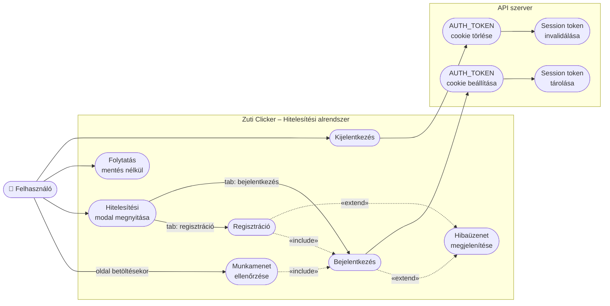

# Használati eset diagram – Hitelesítés



## Leírás

| Használati eset | Szereplő | Leírás |
|---|---|---|
| Regisztráció | Felhasználó | Felhasználónév, e-mail és jelszó megadásával új fiók létrehozása. Sikeres regisztráció után automatikus bejelentkezés történik. |
| Bejelentkezés | Felhasználó | E-mail és jelszó ellenőrzése. Sikeres hitelesítés után `AUTH_TOKEN` session cookie kerül beállításra, és a mentés automatikusan betöltődik. |
| Kijelentkezés | Felhasználó | A session token invalidálása az adatbázisban és a cookie törlése a böngészőből. |
| Munkamenet ellenőrzése | Rendszer | Oldal betöltésekor a `GET /auth/me` endpoint hívásával az alkalmazás megvizsgálja, hogy a felhasználó már be van-e jelentkezve. |
| Folytatás mentés nélkül | Felhasználó | Ha a felhasználó nem kíván bejelentkezni, bezárhatja a figyelmeztető modalt és vendégként folytathatja a játékot munkamenet nélkül. |
| Hibaüzenet megjelenítése | Rendszer | Érvénytelen belépési adatok, foglalt e-mail cím vagy felhasználónév esetén az API által visszaadott hibaüzenet jelenik meg a modalban. |
```
