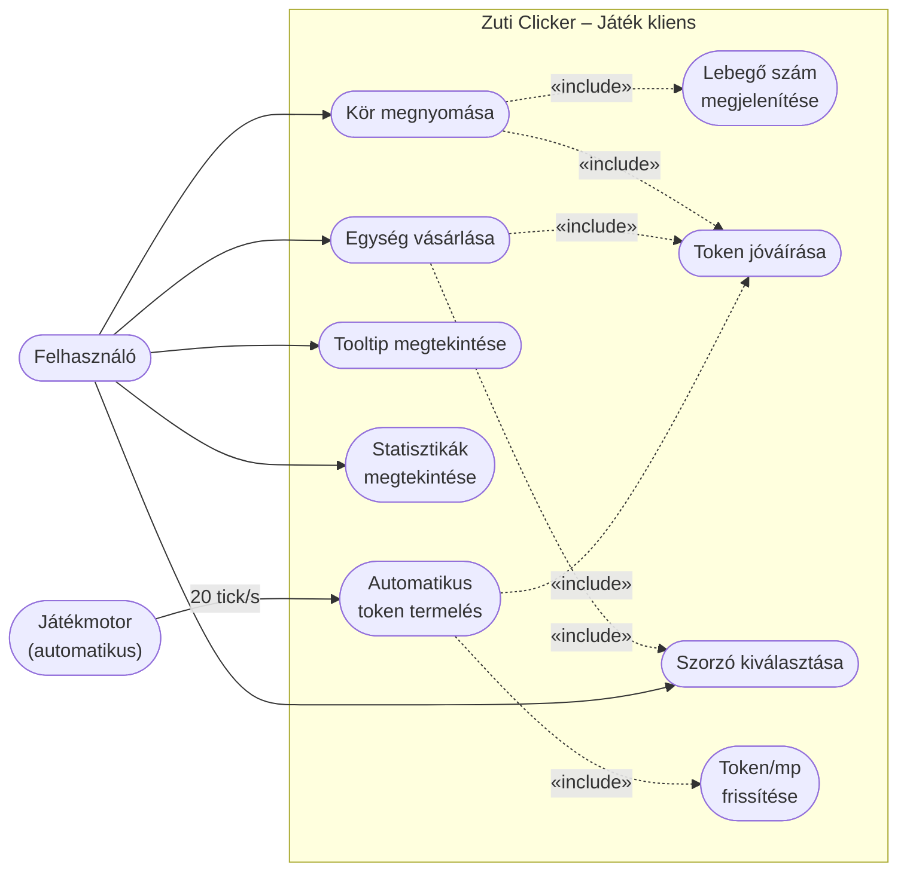

# Használati eset diagram – Játékmenet



## Leírás

| Használati eset | Szereplő | Leírás |
|---|---|---|
| Kör megnyomása | Felhasználó | A középső körre kattintva a felhasználó tokeneket szerez. Minden kattintáskor lebegő `+N` animáció jelenik meg a kör felett, és a token egyenleg azonnal növekszik. |
| Egység vásárlása | Felhasználó | A jobb oldali panelen az elérhető egységek megvásárolhatók. Vásárlásnál a kiválasztott szorzónak megfelelő mennyiség kerül megvételre, ha a felhasználónak elegendő tokenje van. |
| Szorzó kiválasztása | Felhasználó | Az egységpanel tetején 1×, 5×, 10×, 50× és Max szorzók közül lehet választani. A Max szorzó az aktuális egyenlegből megvásárolható maximális mennyiséget jelöli. |
| Tooltip megtekintése | Felhasználó | Egységkártyára húzva az egérkurzort egy tooltip jelenik meg a vásárlás várható árával, az összes termelési növekedéssel és az egységenkénti termeléssel. |
| Statisztikák megtekintése | Felhasználó | A bal oldali státuszoszlop valós időben mutatja az aktuális token egyenleget, a másodpercenkénti termelést (token/s), kattintankénti hozamot, összes szerzett tokent, kattintások számát és az eltelt játékidőt. |
| Automatikus token termelés | Játékmotor | A megvásárolt egységek másodpercenként automatikusan tokeneket termelnek. A játékhurok 20 tick/s sebességgel fut és az összes termelési értéket folyamatosan frissíti. |
```
