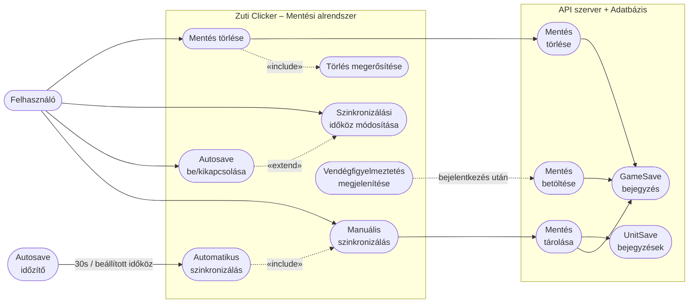

# Használati eset diagram – Mentés kezelése



## Leírás

| Használati eset | Szereplő | Leírás |
|---|---|---|
| Manuális szinkronizálás | Felhasználó | A fejléc „Sync" gombjára kattintva a teljes játékállapot (tokenek, egységek, statisztikák) azonnal elküldésre kerül a `PUT /save` endpointnak. A gomb rövid ideig „✓" jelzést mutat sikeres mentés esetén. |
| Automatikus szinkronizálás | Autosave időzítő | Ha az autosave be van kapcsolva, a rendszer a beállított időközönként (alapértelmezetten 30 másodperc) automatikusan szinkronizálja az állást a szerverrel. |
| Autosave be/kikapcsolása | Felhasználó | Az „Auto" gombra kattintva az automatikus mentés be- vagy kikapcsolható. Kikapcsolt állapotban az időzítő leáll, az intervallum-választó eltűnik. |
| Szinkronizálási időköz módosítása | Felhasználó | Autosave bekapcsolt állapotában a legördülő menüből 15s, 30s, 1m vagy 5m közül választható az automatikus mentés időköze. |
| Mentés betöltése | Rendszer | Bejelentkezés vagy sikeres session ellenőrzés után a `GET /save` endpoint lekéri a mentett állapotot, és visszatölti a játékba (tokenek, egységek száma, eltelt idő stb.). |
| Mentés törlése | Felhasználó | A felhasználói legördülő menüből elérhető „Mentés törlése" opció egy megerősítő dialógust nyit meg. Megerősítés után a `DELETE /save` endpoint meghívásra kerül, és a mentés véglegesen törlődik. |
| Vendégfigyelmeztetés megjelenítése | Rendszer | Ha a munkamenet-ellenőrzés nem talál aktív bejelentkezést, az oldal egy figyelmeztető modalt jelenít meg, amely bejelentkezésre ösztönöz, vagy a felhasználó választhatja a mentés nélküli folytatást is. |
```
